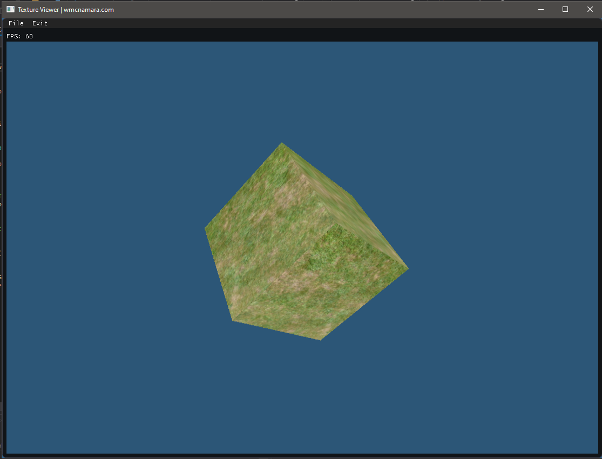

# 3D Texture Viewer

# What is it?
Viewer is a program that allows you to open and view textures on a 3D object with a clean and simple user interface.

# Using Viewer
1. Run Viewer.exe after building with Visual Studio
2. Go to File -> Load Texture
3. Select a texture you like.

# More Info
 - 3D rendering techniques adapted from the [Learn OpenGL](https://learnopengl.com) website.
 - Loads command line arguments to support Windows's "Open File With" functionality.
 - Uses the Dear IMGUI library to render a fast and responsive GUI.
 - Uses a cool event system implementation that I wrote previously. It can be found [here.](https://github.com/wmcnamara/delegate)
 - Uses COM objects and the WINAPI to display a simple and clean file picker for Windows.
